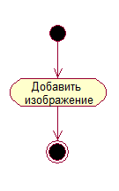
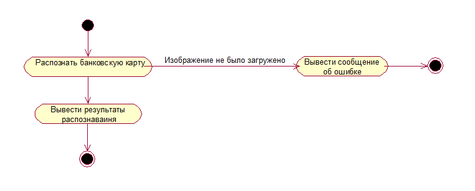
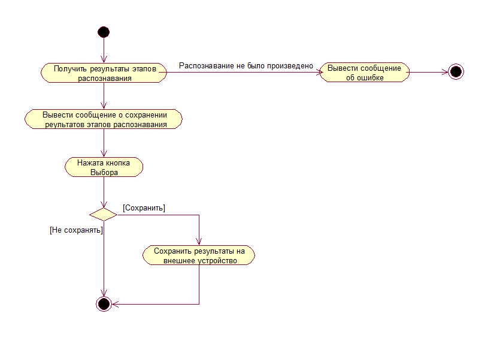

# Диаграммы активностей
---

# Содержание
1. [Загрузить фотографию](#upload_image)  
2. [Распознать банковскую карту](#credit_card_recognition)  
3. [Получить результаты этапов распознавания](#get_recognition_result)

## <a name="upload_image"> 1. Загрузить фотографию </a>

## <a name="credit_card_recognition"> 2. Распознать банковскую карту </a>

## <a name="get_recognition_result"> 3. Получить результаты этапов распознавания </a>
