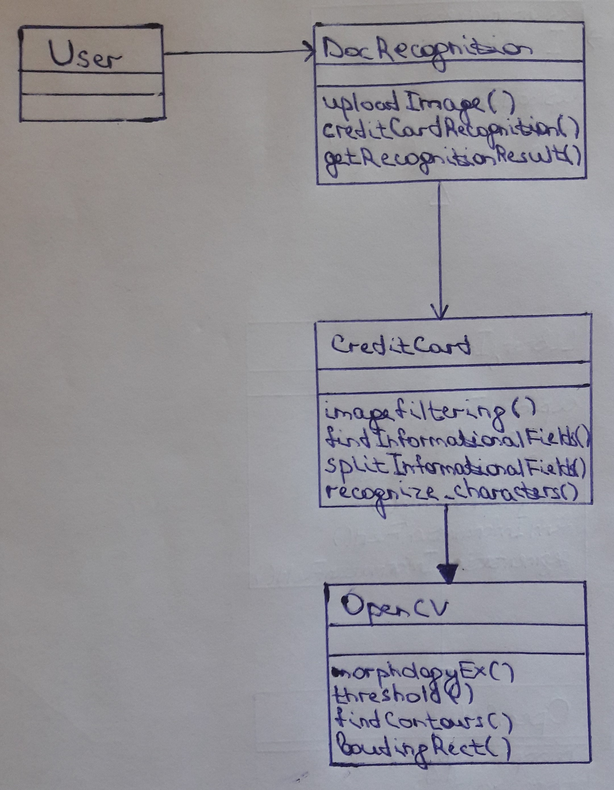
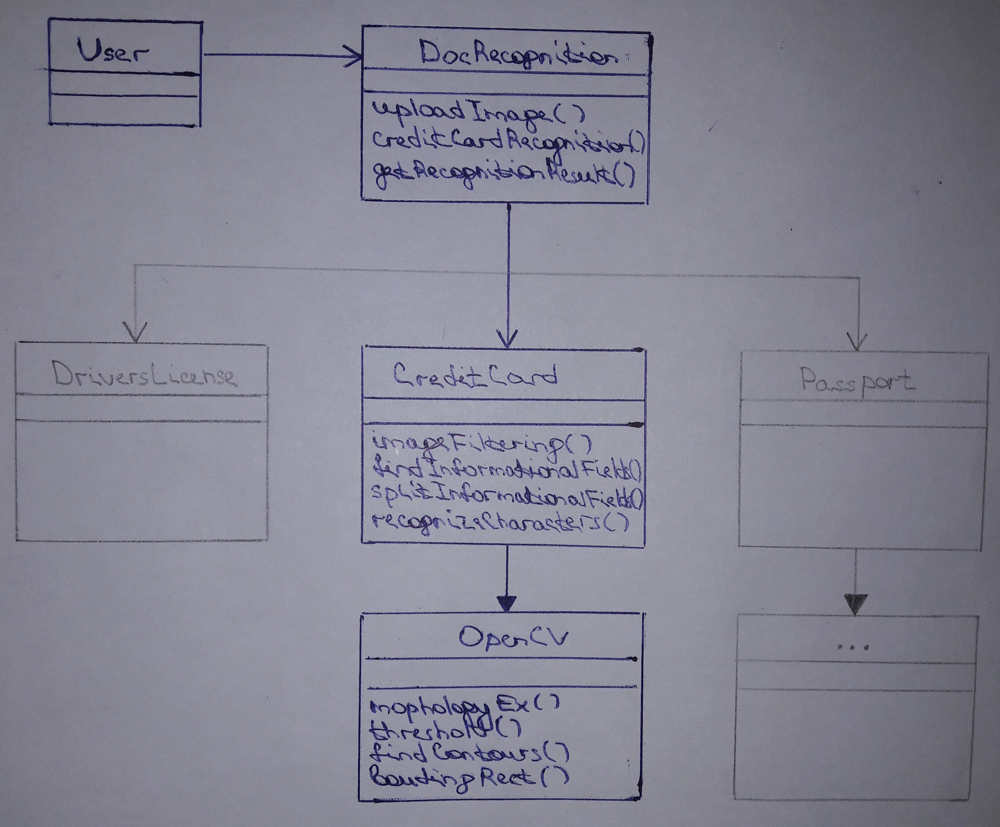

# Диаграмма классов
---
## Содержание:
1. [Диаграмма классов библиотеки распознавания версии 0.1.](#class_diagram)
2. [Обоснование выбранного паттерна проектирования.](#justification_design_pattern)
---

## 1. Диаграмма классов библиотеки распознавания версии 0.1. 

## 2. Обоснавание выбранного паттерна проектирования.
При проектировании и реализации библиотеки распознавания DocRecognition был использован паттерн **Facade**. Для обоснования выбора данного шаблона ниже приводится примерная диаграмма классов следующих версий библиотеки.
    
Как можно заметить, диаграмма следующих версий содержит подсистему классов, взаимодействовать с которой можно посреством интерфейса одного класса DocRecognition. Таким образом, например, чтобы распознать банковскую карту пользователю необходимо вызвать метод creditCardRecogniton(), а не цепочку методов, которые в совокупности и дают желаемый результат. Стоит уточнить, что *фасад* не инкапсулирует классы подсистемы, а, как было сказано ранее, упрощает интерфейс, а также обеспечивает логическую изоляцию клиента от подсистемы. Из слов выше следует - пользователь имеет полный доступ к функциональности подсистемы. Есть и ещё как минимум один плюс от применения выбранного паттерна: при изменение элементов подсистемы, изменять код пользователя не нужно, необходимо лишь внести изменения в *фасад* (класс DocRecognition).    
